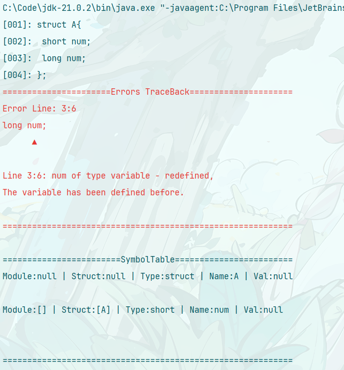
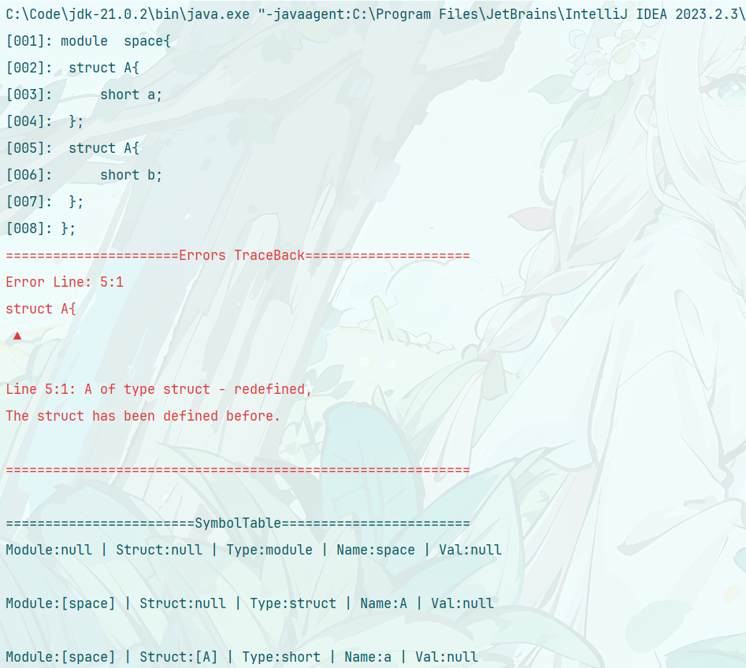
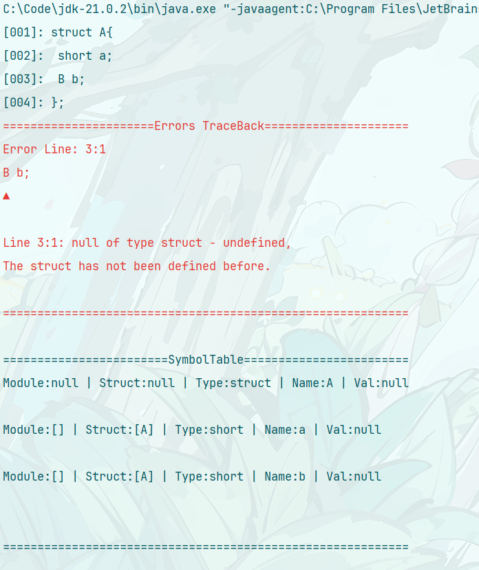

#### 语义分析测试用例举例说明

##### 1.命名冲突。

同一命名空间内，不能出现相同名字的接口定义。

```c++
struct A{
    short num;
    long num;
};
```



```c++
module  space{
struct A{
    short a;
    };
struct B{
    short a;
    };
};
```


```c++
module  space{
	struct A{
    	short a;
	};
	struct A{
    	short b;
	};
};
```

##### 2.未定义即使用

struct 结构需要先定义才能使用。



```c++
struct A{
	short a;
	B b;
};
```



```c++
module space1{
struct B{
    int x;
    };
};
module space2{
    struct A{
    short a;
    B b;
    };
};
```

##### 3.字面量类型检查

字面量的数据类型需要和变量类型相同或兼容。


```c++
struct A{
	short a="a";
};
```


```c++
struct A{
	short a=100000;
};
```


```c++
struct A{
    short a=15.24;
};
```


```c++
struct A{
    short a[4]=[10,12,45.34,"a"];
};

```


module_struct

#### 代码生成

```c++
module space{
	struct A{
		short i1=10;
	};
};
```

```c++
/*
WARNING: THIS FILE IS AUTO-GENERATED. DO NOT MODIFY.

This file was generated from GenCode.idl using "idltoc".
The idltoc tool is part of the RTI Data Distribution Service distribution.
For more information, type 'idltoc -help' at a command shell
or consult the RTI Data Distribution Service manual.
*/
#ifndef GenCode_h
#define GenCode_h

#ifndef rti_me_cpp_hxx
#include "rti_me_cpp.hxx"
#endif

#ifdef NDDS_USER_DLL_EXPORT
#if (defined(RTI_WIN32) || defined(RTI_WINCE))
/* If the code is building on Windows, start exporting symbols. */
#undef NDDSUSERDllExport
#define NDDSUSERDllExport __declspec(dllexport)
#endif
#else
#undef NDDSUSERDllExport
#define NDDSUSERDllExport
#endif

struct space_ASeq;
class space_ATypeSupport;
class space_ADataWriter;
class space_ADataReader;

class space_A
{
public:
    typedef struct space_ASeq Seq;
    typedef space_ATypeSupport TypeSupport;
    typedef space_ADataWriter DataWriter;
    typedef space_ADataReader DataReader;

        CDR_Short i1 = 10;

};

extern const char *space_ATYPENAME;

REDA_DEFINE_SEQUENCE_STRUCT(space_ASeq, space_A);

REDA_DEFINE_SEQUENCE_IN_C(space_ASeq, space_A);

NDDSUSERDllExport extern RTI_BOOL
space_A_initialize(space_A *sample)
{
    CDR_Primitive_init_Short(&sample->i1);

    return RTI_TRUE;
}

NDDSUSERDllExport extern RTI_BOOL
space_A_finalize(space_A *sample)
{
    UNUSED_ARG(sample);
    return RTI_TRUE;
}

#ifdef NDDS_USER_DLL_EXPORT
#if (defined(RTI_WIN32) || defined(RTI_WINCE))
/* If the code is building on Windows, stop exporting symbols. */
#undef NDDSUSERDllExport
#define NDDSUSERDllExport
#endif
#endif

#endif /* hxx */
```

struct_nest:

```c++
module space{
	struct A{
		short i1=10;
	};
	struct B{
		long i2=100;
		A i3;
	};
};
```

```c++
/*
WARNING: THIS FILE IS AUTO-GENERATED. DO NOT MODIFY.

This file was generated from GenCode.idl using "idltoc".
The idltoc tool is part of the RTI Data Distribution Service distribution.
For more information, type 'idltoc -help' at a command shell
or consult the RTI Data Distribution Service manual.
*/
#ifndef GenCode_h
#define GenCode_h

#ifndef rti_me_cpp_hxx
#include "rti_me_cpp.hxx"
#endif

#ifdef NDDS_USER_DLL_EXPORT
#if (defined(RTI_WIN32) || defined(RTI_WINCE))
/* If the code is building on Windows, start exporting symbols. */
#undef NDDSUSERDllExport
#define NDDSUSERDllExport __declspec(dllexport)
#endif
#else
#undef NDDSUSERDllExport
#define NDDSUSERDllExport
#endif

struct space_ASeq;
class space_ATypeSupport;
class space_ADataWriter;
class space_ADataReader;

class space_A
{
public:
    typedef struct space_ASeq Seq;
    typedef space_ATypeSupport TypeSupport;
    typedef space_ADataWriter DataWriter;
    typedef space_ADataReader DataReader;

        CDR_Short i1 = 10;

};

extern const char *space_ATYPENAME;

REDA_DEFINE_SEQUENCE_STRUCT(space_ASeq, space_A);

REDA_DEFINE_SEQUENCE_IN_C(space_ASeq, space_A);

NDDSUSERDllExport extern RTI_BOOL
space_A_initialize(space_A *sample)
{
    CDR_Primitive_init_Short(&sample->i1);

    return RTI_TRUE;
}

NDDSUSERDllExport extern RTI_BOOL
space_A_finalize(space_A *sample)
{
    UNUSED_ARG(sample);
    return RTI_TRUE;
}


struct space_BSeq;
class space_BTypeSupport;
class space_BDataWriter;
class space_BDataReader;

class space_B
{
public:
    typedef struct space_BSeq Seq;
    typedef space_BTypeSupport TypeSupport;
    typedef space_BDataWriter DataWriter;
    typedef space_BDataReader DataReader;

        CDR_Long i2 = 100;

};

extern const char *space_BTYPENAME;

REDA_DEFINE_SEQUENCE_STRUCT(space_BSeq, space_B);

REDA_DEFINE_SEQUENCE_IN_C(space_BSeq, space_B);

NDDSUSERDllExport extern RTI_BOOL
space_B_initialize(space_B *sample)
{
    CDR_Primitive_init_Long(&sample->i2);

    return RTI_TRUE;
}

NDDSUSERDllExport extern RTI_BOOL
space_B_finalize(space_B *sample)
{
    UNUSED_ARG(sample);
    return RTI_TRUE;
}

#ifdef NDDS_USER_DLL_EXPORT
#if (defined(RTI_WIN32) || defined(RTI_WINCE))
/* If the code is building on Windows, stop exporting symbols. */
#undef NDDSUSERDllExport
#define NDDSUSERDllExport
#endif
#endif

#endif /* hxx */
```

no_module:

```c++
struct A{
	short i1=10;
};
```

```c++
/*
WARNING: THIS FILE IS AUTO-GENERATED. DO NOT MODIFY.

This file was generated from GenCode.idl using "idltoc".
The idltoc tool is part of the RTI Data Distribution Service distribution.
For more information, type 'idltoc -help' at a command shell
or consult the RTI Data Distribution Service manual.
*/
#ifndef GenCode_h
#define GenCode_h

#ifndef rti_me_cpp_hxx
#include "rti_me_cpp.hxx"
#endif

#ifdef NDDS_USER_DLL_EXPORT
#if (defined(RTI_WIN32) || defined(RTI_WINCE))
/* If the code is building on Windows, start exporting symbols. */
#undef NDDSUSERDllExport
#define NDDSUSERDllExport __declspec(dllexport)
#endif
#else
#undef NDDSUSERDllExport
#define NDDSUSERDllExport
#endif

struct ASeq;
class ATypeSupport;
class ADataWriter;
class ADataReader;

class A
{
public:
    typedef struct ASeq Seq;
    typedef ATypeSupport TypeSupport;
    typedef ADataWriter DataWriter;
    typedef ADataReader DataReader;

        CDR_Short i1 = 10;

};

extern const char *ATYPENAME;

REDA_DEFINE_SEQUENCE_STRUCT(ASeq, A);

REDA_DEFINE_SEQUENCE_IN_C(ASeq, A);

NDDSUSERDllExport extern RTI_BOOL
A_initialize(A *sample)
{
    CDR_Primitive_init_Short(&sample->i1);

    return RTI_TRUE;
}

NDDSUSERDllExport extern RTI_BOOL
A_finalize(A *sample)
{
    UNUSED_ARG(sample);
    return RTI_TRUE;
}

#ifdef NDDS_USER_DLL_EXPORT
#if (defined(RTI_WIN32) || defined(RTI_WINCE))
/* If the code is building on Windows, stop exporting symbols. */
#undef NDDSUSERDllExport
#define NDDSUSERDllExport
#endif
#endif

#endif /* hxx */

```

module_nest

```c++
module space{
	module inner{
		struct A{
			short i1=10;
		};
	};
};

```

```c++
/*
WARNING: THIS FILE IS AUTO-GENERATED. DO NOT MODIFY.

This file was generated from GenCode.idl using "idltoc".
The idltoc tool is part of the RTI Data Distribution Service distribution.
For more information, type 'idltoc -help' at a command shell
or consult the RTI Data Distribution Service manual.
*/
#ifndef GenCode_h
#define GenCode_h

#ifndef rti_me_cpp_hxx
#include "rti_me_cpp.hxx"
#endif

#ifdef NDDS_USER_DLL_EXPORT
#if (defined(RTI_WIN32) || defined(RTI_WINCE))
/* If the code is building on Windows, start exporting symbols. */
#undef NDDSUSERDllExport
#define NDDSUSERDllExport __declspec(dllexport)
#endif
#else
#undef NDDSUSERDllExport
#define NDDSUSERDllExport
#endif

struct space_inner_ASeq;
class space_inner_ATypeSupport;
class space_inner_ADataWriter;
class space_inner_ADataReader;

class space_inner_A
{
public:
    typedef struct space_inner_ASeq Seq;
    typedef space_inner_ATypeSupport TypeSupport;
    typedef space_inner_ADataWriter DataWriter;
    typedef space_inner_ADataReader DataReader;

        CDR_Short i1 = 10;

};

extern const char *space_inner_ATYPENAME;

REDA_DEFINE_SEQUENCE_STRUCT(space_inner_ASeq, space_inner_A);

REDA_DEFINE_SEQUENCE_IN_C(space_inner_ASeq, space_inner_A);

NDDSUSERDllExport extern RTI_BOOL
space_inner_A_initialize(space_inner_A *sample)
{
    CDR_Primitive_init_Short(&sample->i1);

    return RTI_TRUE;
}

NDDSUSERDllExport extern RTI_BOOL
space_inner_A_finalize(space_inner_A *sample)
{
    UNUSED_ARG(sample);
    return RTI_TRUE;
}

#ifdef NDDS_USER_DLL_EXPORT
#if (defined(RTI_WIN32) || defined(RTI_WINCE))
/* If the code is building on Windows, stop exporting symbols. */
#undef NDDSUSERDllExport
#define NDDSUSERDllExport
#endif
#endif

#endif /* hxx */
```

all_type

```c++
module space{
	struct A{
		short i1=10;
		int16 i2=10;
		long i3=100;
		int32 i4=100;
		long long i5=1000;
		int64 i6=1000;
		unsigned short i7=10;
		uint16 i8=10;
		unsigned long i9=100;
		uint32 i10=100;
		unsigned long long i11=1000;
		uint64 i12=1000;
		char c0='a';
		string c1="abc";
		boolean c2=true;
		float c3=10.901f;
		double c4=23.234d;
		long double c5=12.23456432235d;
		short arr[10]=[0,1,2,3,4,5,6,7,8,9];
	};
};
```

````c++

```c++
/*
WARNING: THIS FILE IS AUTO-GENERATED. DO NOT MODIFY.

This file was generated from GenCode.idl using "idltoc".
The idltoc tool is part of the RTI Data Distribution Service distribution.
For more information, type 'idltoc -help' at a command shell
or consult the RTI Data Distribution Service manual.
*/
#ifndef GenCode_h
#define GenCode_h

#ifndef rti_me_cpp_hxx
#include "rti_me_cpp.hxx"
#endif

#ifdef NDDS_USER_DLL_EXPORT
#if (defined(RTI_WIN32) || defined(RTI_WINCE))
/* If the code is building on Windows, start exporting symbols. */
#undef NDDSUSERDllExport
#define NDDSUSERDllExport __declspec(dllexport)
#endif
#else
#undef NDDSUSERDllExport
#define NDDSUSERDllExport
#endif

struct space_ASeq;
class space_ATypeSupport;
class space_ADataWriter;
class space_ADataReader;

class space_A
{
public:
    typedef struct space_ASeq Seq;
    typedef space_ATypeSupport TypeSupport;
    typedef space_ADataWriter DataWriter;
    typedef space_ADataReader DataReader;

        CDR_Short i1 = 10;
        CDR_Short i2 = 10;
        CDR_Long i3 = 100;
        CDR_Long i4 = 100;
        CDR_Longlong i5 = 1000;
        CDR_LongLong i6 = 1000;
        CDR_Unsignedshort i7 = 10;
        CDR_UnsignedShort i8 = 10;
        CDR_Unsignedlong i9 = 100;
        CDR_Short arr[10] = {};
        CDR_Short arr[0] = {};
        CDR_Short arr[1] = {};
        CDR_Short arr[2] = {};
        CDR_Short arr[3] = {};
        CDR_Short arr[4] = {};
        CDR_Short arr[5] = {};
        CDR_Short arr[6] = {};
        CDR_Short arr[7] = {};
        CDR_Short arr[8] = {};
        CDR_Short arr[9] = {};
        CDR_Char c0 = 'a';
        CDR_String c1 = "abc";
        CDR_Boolean c2 = true;
        CDR_Float c3 = 10.901f;
        CDR_Double c4 = 23.234d;
        CDR_Longdouble c5 = 12.23456432235d;
        CDR_UnsignedLong i10 = 100;
        CDR_Unsignedlonglong i11 = 1000;
        CDR_UnsignedLongLong i12 = 1000;

};

extern const char *space_ATYPENAME;

REDA_DEFINE_SEQUENCE_STRUCT(space_ASeq, space_A);

REDA_DEFINE_SEQUENCE_IN_C(space_ASeq, space_A);

NDDSUSERDllExport extern RTI_BOOL
space_A_initialize(space_A *sample)
{
    CDR_Primitive_init_Short(&sample->i1);
    CDR_Primitive_init_Short(&sample->i2);
    CDR_Primitive_init_Long(&sample->i3);
    CDR_Primitive_init_Long(&sample->i4);
    CDR_Primitive_init_Longlong(&sample->i5);
    CDR_Primitive_init_LongLong(&sample->i6);
    CDR_Primitive_init_Unsignedshort(&sample->i7);
    CDR_Primitive_init_UnsignedShort(&sample->i8);
    CDR_Primitive_init_Unsignedlong(&sample->i9);

        CDR_Primitive_init_Array(
                sample->arr, ((10) * CDR_SHORT_SIZE));

        CDR_Primitive_init_Array(
                sample->arr, ((0) * CDR_SHORT_SIZE));

        CDR_Primitive_init_Array(
                sample->arr, ((1) * CDR_SHORT_SIZE));

        CDR_Primitive_init_Array(
                sample->arr, ((2) * CDR_SHORT_SIZE));

        CDR_Primitive_init_Array(
                sample->arr, ((3) * CDR_SHORT_SIZE));

        CDR_Primitive_init_Array(
                sample->arr, ((4) * CDR_SHORT_SIZE));

        CDR_Primitive_init_Array(
                sample->arr, ((5) * CDR_SHORT_SIZE));

        CDR_Primitive_init_Array(
                sample->arr, ((6) * CDR_SHORT_SIZE));

        CDR_Primitive_init_Array(
                sample->arr, ((7) * CDR_SHORT_SIZE));

        CDR_Primitive_init_Array(
                sample->arr, ((8) * CDR_SHORT_SIZE));

        CDR_Primitive_init_Array(
                sample->arr, ((9) * CDR_SHORT_SIZE));

    CDR_Primitive_init_Char(&sample->c0);

        if (!CDR_String_initialize(&sample->c1, (255)))
        {
            return RTI_FALSE;
        }

    CDR_Primitive_init_Boolean(&sample->c2);
    CDR_Primitive_init_Float(&sample->c3);
    CDR_Primitive_init_Double(&sample->c4);
    CDR_Primitive_init_Longdouble(&sample->c5);
    CDR_Primitive_init_UnsignedLong(&sample->i10);
    CDR_Primitive_init_Unsignedlonglong(&sample->i11);
    CDR_Primitive_init_UnsignedLongLong(&sample->i12);

    return RTI_TRUE;
}

NDDSUSERDllExport extern RTI_BOOL
space_A_finalize(space_A *sample)
{
    UNUSED_ARG(sample);
        {
                RTI_UINT32 i;

                for (i = 0; i < (10); i++)
                {
                    if (!CDR_Short_copy(&dst->arr[i],
                                        &src->arr[i]))
                    {
                        return RTI_FALSE;
                    }
                }
        }

        {
                RTI_UINT32 i;

                for (i = 0; i < (0); i++)
                {
                    if (!CDR_Short_copy(&dst->arr[i],
                                        &src->arr[i]))
                    {
                        return RTI_FALSE;
                    }
                }
        }

        {
                RTI_UINT32 i;

                for (i = 0; i < (1); i++)
                {
                    if (!CDR_Short_copy(&dst->arr[i],
                                        &src->arr[i]))
                    {
                        return RTI_FALSE;
                    }
                }
        }

        {
                RTI_UINT32 i;

                for (i = 0; i < (2); i++)
                {
                    if (!CDR_Short_copy(&dst->arr[i],
                                        &src->arr[i]))
                    {
                        return RTI_FALSE;
                    }
                }
        }

        {
                RTI_UINT32 i;

                for (i = 0; i < (3); i++)
                {
                    if (!CDR_Short_copy(&dst->arr[i],
                                        &src->arr[i]))
                    {
                        return RTI_FALSE;
                    }
                }
        }

        {
                RTI_UINT32 i;

                for (i = 0; i < (4); i++)
                {
                    if (!CDR_Short_copy(&dst->arr[i],
                                        &src->arr[i]))
                    {
                        return RTI_FALSE;
                    }
                }
        }

        {
                RTI_UINT32 i;

                for (i = 0; i < (5); i++)
                {
                    if (!CDR_Short_copy(&dst->arr[i],
                                        &src->arr[i]))
                    {
                        return RTI_FALSE;
                    }
                }
        }

        {
                RTI_UINT32 i;

                for (i = 0; i < (6); i++)
                {
                    if (!CDR_Short_copy(&dst->arr[i],
                                        &src->arr[i]))
                    {
                        return RTI_FALSE;
                    }
                }
        }

        {
                RTI_UINT32 i;

                for (i = 0; i < (7); i++)
                {
                    if (!CDR_Short_copy(&dst->arr[i],
                                        &src->arr[i]))
                    {
                        return RTI_FALSE;
                    }
                }
        }

        {
                RTI_UINT32 i;

                for (i = 0; i < (8); i++)
                {
                    if (!CDR_Short_copy(&dst->arr[i],
                                        &src->arr[i]))
                    {
                        return RTI_FALSE;
                    }
                }
        }

        {
                RTI_UINT32 i;

                for (i = 0; i < (9); i++)
                {
                    if (!CDR_Short_copy(&dst->arr[i],
                                        &src->arr[i]))
                    {
                        return RTI_FALSE;
                    }
                }
        }


        CDR_String_finalize(&sample->c1);


    return RTI_TRUE;
}

#ifdef NDDS_USER_DLL_EXPORT
#if (defined(RTI_WIN32) || defined(RTI_WINCE))
/* If the code is building on Windows, stop exporting symbols. */
#undef NDDSUSERDllExport
#define NDDSUSERDllExport
#endif
#endif

#endif /* hxx */
````
